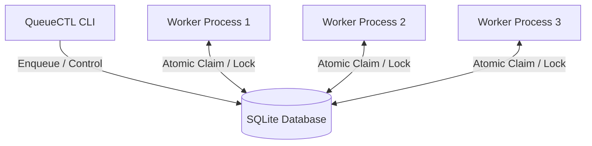

# 📐 QueueCTL System Design & Architecture

This document provides a technical deep-dive into the architectural design, concurrency controls, and fail-safe mechanisms implemented in the **QueueCTL** background job queueing system.

---

## 🧭 System Overview

QueueCTL is designed as a serverless, concurrency-safe, and zero-dependency job processor. It utilizes **SQLite** in Write-Ahead Logging (WAL) mode as a shared broker and registry, allowing multiple independent worker processes to safely query, claim, and execute commands in parallel.



---

## 🛠️ Architecture Layers

### 1. Storage & Database Layer (`storage/`)
- **SQLite Engine**: Embedded database handles structural persistence.
- **WAL Mode Enabled**: Enables concurrent read operations while writes are happening, significantly improving throughput when multiple worker instances are reading/writing.
- **Repository Pattern (`repository.js`)**: Encapsulates all SQL execution, guaranteeing parameterization and sanitization to prevent injection issues.

### 2. Queue & Lock Layer (`queue/`, `utils/lock.js`)
- **Atomic Pick**: The pick-and-claim query is executed inside a serialized SQLite transaction:
  ```sql
  BEGIN IMMEDIATE TRANSACTION;
  -- Select next pending job and mark as processing
  UPDATE Jobs 
  SET state = 'processing', locked_by = ?, locked_at = ? 
  WHERE id = (SELECT id FROM Jobs WHERE state = 'pending' LIMIT 1)
  RETURNING *;
  COMMIT;
  ```
- **Self-Healing Lock Reclamation**: Before a worker picks a new job, it executes `reclaimStaleLocks()`. If a job is locked by a worker process (PID) that is no longer active in the OS (verified via standard Unix signal checking: `process.kill(pid, 0)`), the system immediately resets the job back to `pending` and deletes the orphaned worker record.

### 3. Worker & Executor Layer (`worker/`)
- **Graceful Shutdown**: Workers listen for shutdown flags in the database. When a stop command is issued, running workers complete their current executing task before exiting.
- **Execution isolation**: Commands are run in subprocesses via `child_process.exec()`. Standard output and error exit codes are tracked to determine job success or failure.

### 4. DLQ & Retry Layer (`services/`, `queue/retryManager.js`)
- **Exponential Backoff**: If a job fails, the next execution is scheduled using the formula:
  $$\text{delay} = \text{backoff\_base} \times 2^{\text{attempts}}$$
- **DLQ Escalation**: Once a job's attempts exceed `max_retries`, it transitions to the `dead` state, marking its entry into the Dead Letter Queue (DLQ).

---

## 💾 Database Schema

The SQLite schema consists of two main tables:

### `Jobs` Table
| Column Name | Type | Description |
|---|---|---|
| `id` | TEXT (PK) | Unique Job ID |
| `command` | TEXT | Shell command to execute |
| `state` | TEXT | `pending`, `processing`, `completed`, `failed`, or `dead` |
| `attempts` | INTEGER | Number of failed runs |
| `max_retries`| INTEGER | Maximum allowed retry attempts |
| `backoff_base`| INTEGER | Time scale for backoff (ms) |
| `run_at` | INTEGER | Milliseconds timestamp for next run |
| `locked_by` | TEXT | Worker ID holding the lock |
| `locked_at` | INTEGER | Timestamp when the job was locked |

### `Workers` Table
| Column Name | Type | Description |
|---|---|---|
| `id` | TEXT (PK) | Unique Worker ID (e.g. `worker-<pid>-<uuid>`) |
| `pid` | INTEGER | Process ID of the host worker process |
| `state` | TEXT | Current state (`running`, `draining`, etc.) |
| `last_seen` | INTEGER | Heartbeat timestamp |

---

## ⚡ Key Design Decisions & Trade-offs

1. **SQLite over Redis/RabbitMQ**: For a CLI-based tool, external dependencies like Redis or RabbitMQ are complex to configure. SQLite provides ACID-compliant transactions and high-speed local persistence without any operational overhead.
2. **PID Checks over Heartbeat Daemons**: Network heartbeats require running central processes to listen to worker status. Checking if PIDs are alive using Node's standard process checks is lightweight, serverless, and resilient across force kills.
